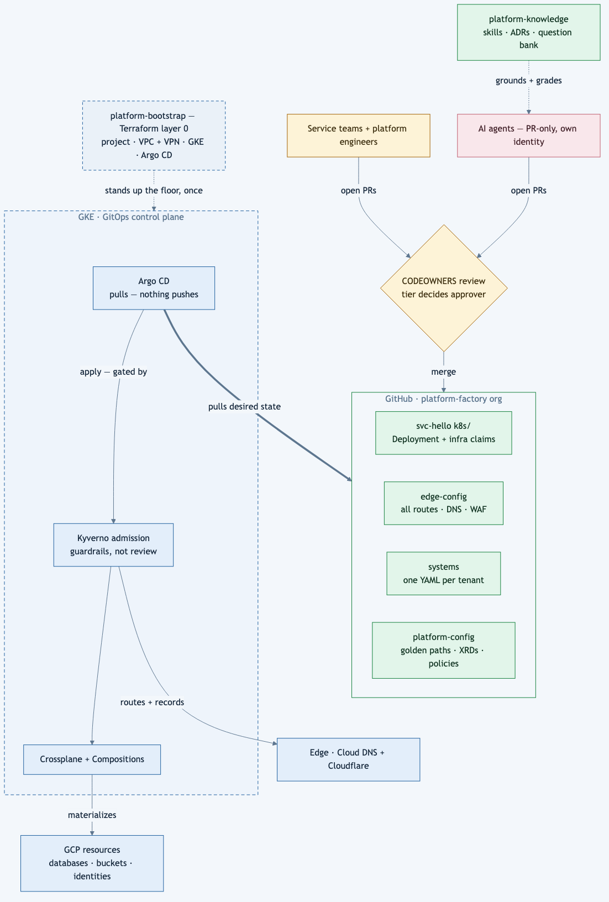
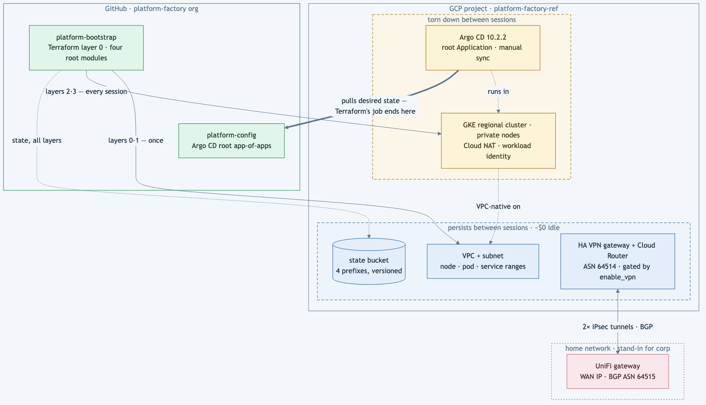

# Platform Factory

An opinionated developer-platform pattern — GitOps control plane, approval-boundary
repo topology, and a knowledge-as-code layer — with a **GCP reference
implementation** being built on GKE, Argo CD, Crossplane, and Kyverno (Gateway
API is planned for M3 and is not built yet).

Designed and written by **Ronak Patel**
([ORCID 0009-0002-3753-2193](https://orcid.org/0009-0002-3753-2193),
[thecloudgeek LLC](https://github.com/thecloudgeek)).

[](https://doi.org/10.5281/zenodo.22848132)

> **Status: M1 (Spine) and M2 (Paved road) are built and closed, with their
> claims graded; M3 (Approval boundary) is next.** The build runs as a
> pre-registered experiment: the design's falsifiable claims — 22 of them —
> were recorded in [the claims register](docs/build-log/claims-register.md) on
> 2026-07-31, *before* the first build command. The register is append-only;
> three more claims were added later, each dated (C-23 during M1; C-24 and C-25
> at the M2 close). Some tests' pass criteria were operationalised in a dated
> readiness walk at the start of the milestone — for M2 on 2026-09-02, and on
> 2026-09-14 in [ADR-0012](docs/adr/0012-system-is-the-unit-team-is-a-field.md)
> and [ADR-0013](docs/adr/0013-database-credentials-are-iam-identities.md) —
> both before that milestone's first build command; the register itself was not
> reworded. The [M2 log](docs/build-log/m2-paved-road.md) and the
> [register](docs/build-log/claims-register.md) record which, and when. Each
> milestone grades claims with evidence — including the misses. As of the M2
> close (2026-09-17), eight of the 25 claims carry a grade: five HELD, three
> ADJUSTED (the design had to change; superseding ADR linked), none WRONG. Two
> of the HELD grades are scoped in the register itself — C-03 and C-04 held
> only for the part of the surface built so far. The other seventeen are
> untested, including one M2 stretch claim (C-08) that was not attempted.
> Follow along — this repo is being built in public.

## The pattern in five sentences

1. **Git is the source of truth for everything; Kubernetes is the control plane.**
   Terraform's only job is to bootstrap what the control plane can't create yet.
2. **The repo boundary is the approval boundary.** Everything a team ships lives in
   the team's repo by default; something moves to a central repo only when its
   *approver* is someone other than the team shipping it.
3. **Developers declare intent as namespaced resources next to their Deployment**
   (Crossplane XRs for databases, buckets, identities); Compositions materialize
   the cloud resources, and admission policy — not human review — enforces the
   guardrails.
4. **The edge is config, not tickets.** All routes and DNS live in one
   `edge-config` repo where folder structure routes the review (security approves
   `external/`) and a schema field drives what gets materialized.
5. **Knowledge is treated exactly like code** — born via PR, owned via CODEOWNERS,
   flagged stale by CI when its dependencies change, and regression-tested by a
   question bank that agents are graded against.

## Repo topology

This repo is the design seed. The reference implementation lives beside it in
the [platform-factory](https://github.com/platform-factory) GitHub org: the seven
repos below, because the topology itself is the point, plus `svc-ledger`, a
placeholder service repo added at M2 so the one-file onboarding test (claim
C-05) had a second tenant. The tree shows the design, not what is built. As of
the M2 close: `platform-config` runs Crossplane, Kyverno and the
XRDs/Compositions, while ESO, external-dns and the gateway are M3 work;
`edge-config` (M3) and `platform-knowledge` (M4) are scaffolds; and
`template-service` is still a scaffold that M2 did not build.

```
├─ platform-bootstrap    Terraform layer 0: project, VPC, GKE, workload identity,
│                        Argo CD bootstrap — Terraform's last job
├─ platform-config       Argo root (app-of-apps): Crossplane, Kyverno, ESO,
│                        external-dns, gateway + XRDs/Compositions (golden paths)
├─ systems               one YAML per tenant (System XR)        [platform approves]
├─ edge-config           ALL routes/DNS/WAF                     [security approves external/]
├─ template-service      "create repo from template" golden path
├─ svc-hello             canonical service: app code + k8s/ (Deployment + XRs)
└─ platform-knowledge    skills/, adr/, standards/, questions/  [light review, no deploy risk]
```

Three tiers of change, three approval speeds: service-repo `k8s/` (team approves;
schema + admission policy enforce) → `edge-config` (security via CODEOWNERS) →
`systems` (platform approves).

## Why GCP, and why it still counts as cloud-agnostic

The pattern is the deliverable; the cloud is an implementation detail. The
reference implementation runs on GKE with Crossplane's GCP provider family —
swapping the provider family is the portability story, and the research here
deliberately covers both clouds' primitives. See
[ADR-0005](docs/adr/0005-gcp-crossplane-reference-implementation.md).

## Architecture at a glance

The whole pattern — a change enters as a PR, CODEOWNERS routes it to the right
approver by which repo it touches, Argo CD pulls the result, and admission
policy (not review meetings) enforces the guardrails on the way in:



The floor it stands on — `platform-bootstrap`'s Terraform layers, split by
lifecycle so the expensive parts (the cluster and Argo CD) are torn down
between working sessions while the network, identities and durable data
persist. Every image the cluster runs arrives through Artifact Registry
pull-through caches on Google's own network; the only internet egress the
cluster itself generates is Argo CD's git pull (ADR-0010; claim C-23, graded
at M1):



Interactive versions of both (zoomable, light/dark) live in
[`docs/diagrams/`](docs/diagrams/) — open the HTML files locally.

Both diagrams are design-time snapshots from early M1 (2026-08-07) and have
not been redrawn: they show a site-to-site VPN that was never built (ADR-0011
replaced it with an identity-gated endpoint and a Tailscale jump box), a
manually synced root Application (it has auto-synced since 2026-08-13), and
milestone status as of M1. The build logs are current; the diagrams are not.

## What's in this repo now

- `docs/design/` — the platform pattern, the knowledge-as-code layer, and the
  factory framing (the personas it serves + the autonomy narrative), in full
- `docs/adr/` — decision records (the knowledge layer, dogfooded from day one);
  ADRs are never edited, so [the index](docs/adr/README.md) records what each
  decision later became
- `docs/build-log/` — the build-as-experiment method (ADR-0008): the claims
  register (pre-registered 2026-07-31, append-only with dated additions) and
  one graded evidence entry per milestone —
  [M1](docs/build-log/m1-spine.md) and [M2](docs/build-log/m2-paved-road.md)
  so far, surprises included
- `docs/diagrams/` — architecture diagrams: static snapshots above,
  interactive HTML originals
- `research/` — primary-source research digests: API gateway landscape 2026,
  approval evidence and earned autonomy 2026, Crossplane v2 review, Kubernetes
  egress control 2026, prior-art landscape

## Provenance

These are patterns I've designed and run in production at fintech scale —
multi-year GKE operation, PR-gated system provisioning, one-repo-per-service
GitOps, and a curated knowledge layer. This repo is the from-scratch, generic
reference implementation of those patterns: no client or employer code, config,
or data — pattern only.

## Citing and archives

Cite Platform Factory by its DOI,
[10.5281/zenodo.22848132](https://doi.org/10.5281/zenodo.22848132), which
always resolves to the newest archived release. Each milestone close is
released here, archived by Zenodo with its own version DOI (the first is
`m2-close`), and the org repos are tagged to match and archived by
[Software Heritage](https://archive.softwareheritage.org/).

This repo lived at `github.com/thecloudgeek/platform-factory` until
2026-09-19, when it moved into the org as `platform-factory-concept`, keeping
its dated commit history. The `m2-close` Zenodo record and the org repos'
`m2-close` tags were made before the move and cite the old address.

## License

Apache-2.0. If you redistribute or build on this work, the attribution to keep
is in [NOTICE](NOTICE); [CITATION.cff](CITATION.cff) says how to cite it.
